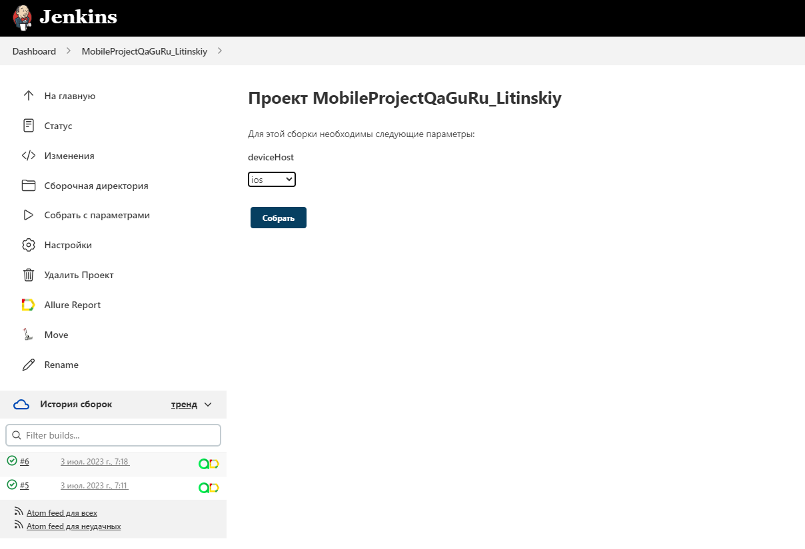
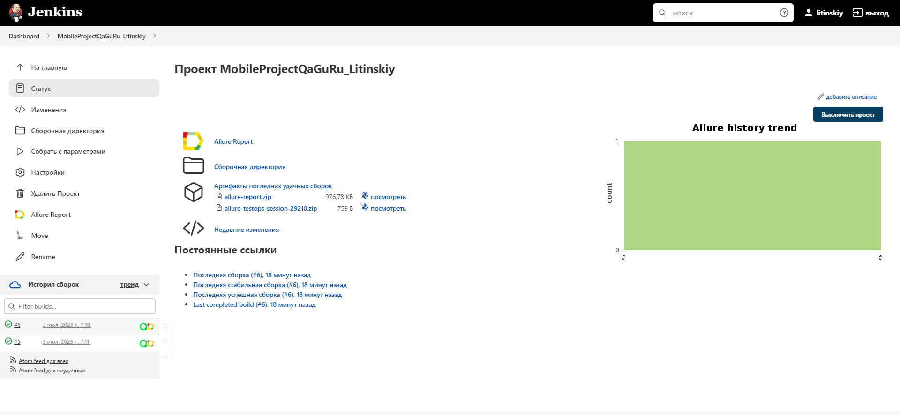
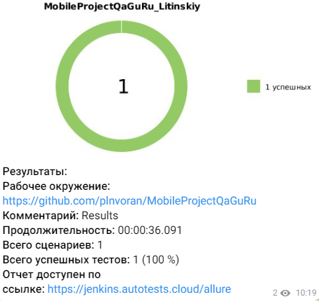
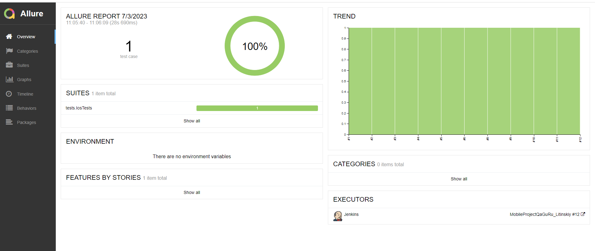
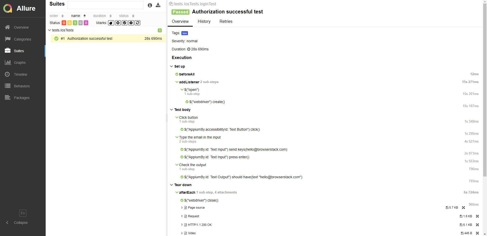
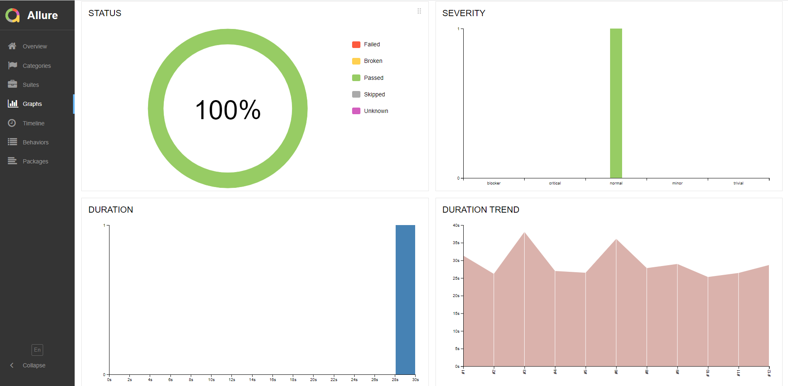
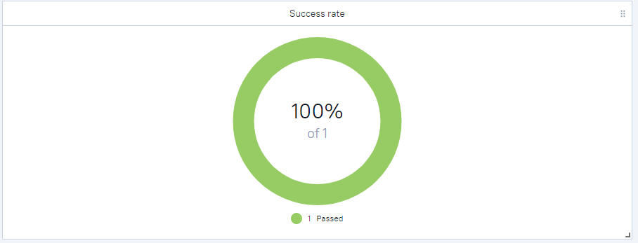
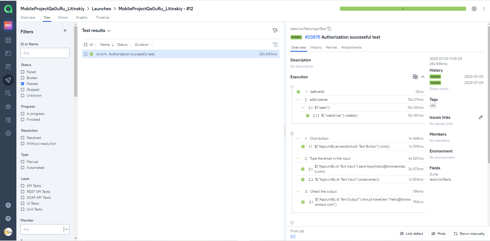
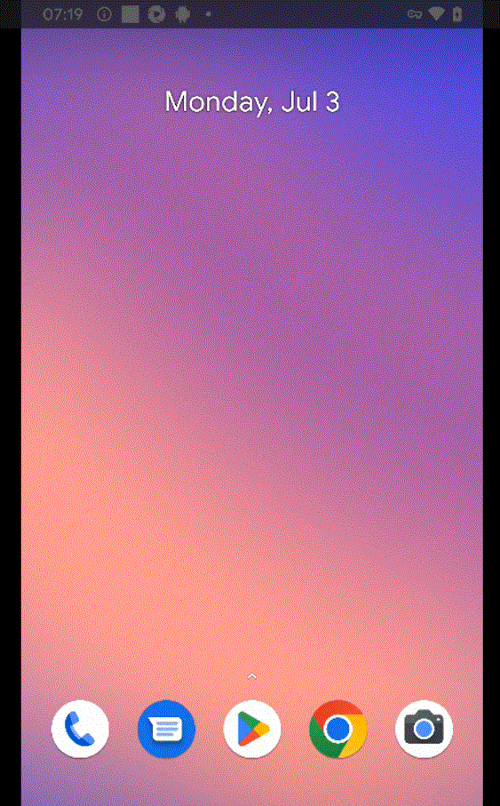

<h2 align="center">The project to automate testing of the mobile version of the wikipedia.org website</h2>
<p  align="center">


</p>

# <a name="Contents">Contents</a>
+ [Description](#Description)
+ [Technologies and Tools](#Technologies-and-Tools)
+ [Launch Options](#Launch-Options)
  + [Commands for gradle](#Commands-for-gradle)
  + [Run in Jenkins](#Run-in-Jenkins)
+ [Telegram notifications](#Telegram-notifications)
+ [Test results in Allure Report](#Test-results-in-Allure-Report)
+ [Integration with Allure TestOps](#Integration-with-Allure-TestOps)
+ [Test run video](#Test-run-video)

# <a name="Description">Description</a>
The project consists of autotests for Android (BrowserStack, Android Studio) and iOS (BrowserStack).
A short list of interesting facts about the project:
- [x] Parameterized tests: 'android' - runs on BrowserStack, 'ios' - runs on BrowserStack, 'mobile' - runs on Android Studio
- [x] Different config files to run test depending on build options
- [x] Configuration with `Owner` library
- [x] Integration with `Allure TestOps`
- [x] Autotests as test documentation
- [x] Notifications in Telegram

# <a name="Technologies and Tools">Technologies and Tools</a>
<p  align="center">
  <code></code>
  <code></code>
  <code></code>
  <code></code>
  <code></code>
  <code></code>
  <code></code>
  <code></code>
  <code></code>
  <code></code>
  <code></code>
  <code></code>
  <code></code>
  <code></code>
</p>


`Java` - Autotest programming language \
`Selenide` - a framework on which autotests are written \
`Gradle` - automatic build tool \
`JUnit5` - testing framework \
`Jenkins` - CI/CD to run tests \
`Selenoid` - for launching a browser remotely in `Docker` containers \
`Browserstack` - for running mobile tests remotely.\
`Android Studio`, `Appium` - for running mobile tests locally on a mobile device emulator.\
`Allure Report` - for building graphical reports \
`Telegram Bot` - for notifications about test results in telegram bot\
`Allure TestOps` - as a test management system

[Back to Contents ⬆](#Contents)

# <a name="Launch Options">Launch Options</a>

## <a name="Commands-for-gradle">Commands-for-gradle</a>

To run locally/in Jenkins, use the following command:
```bash
gradle clean
${deviceHost}
-DdeviceHost="${deviceHost}"
```

`deviceHost` - specifies the environment to run these tests:
>- *android - runs autotest for Android in BrowserStack*
>- *ios - runs autotest for iOS in BrowserStack*
>- *mobile - runs Android autotest in Android Studio*


Additional properties (such as device, OS version, path to BrowserStack server, etc.) are retrieved from the corresponding configuration file (depending on the value of `deviceHost`):
```bash
./resources/${deviceHost}.properties
```

[Back to Contents ⬆](#Contents)

## <a name="Run in Jenkins">Run in [Jenkins](https://jenkins.autotests.cloud/job/MobileProjectQaGuRu_Litinskiy/)</a>

The build with parameters in Jenkins is started with the necessary ***deviceHost***:

<p  align="center">  </p>


Home page of the project:
<p  align="center">

</p>


The project build result is available in:
>- <code><strong>*Allure Report*</strong></code>
>- <code><strong>*Telegram bot*</strong></code>
>- <code><strong>*Allure TestOps*</strong></code>


[Back to Contents ⬆](#Contents)


## <a name="Telegram">[Telegram notification about test run results](https://t.me/HWLitinskiy)</a>

The Telegram bot Autotests bot sends a graphical report of each build.
<p  align="center"> </p>


# <a name="AllureReport">Результаты тестов в [Allure Report](https://jenkins.autotests.cloud/job/utebaliyevabotakoz_project_mobile/allure/allure)</a>

## Main page

<p align="center">
  
</p>

##  Tests

<p align="center">
  
</p>


##  Graphs

<p align="center">
  
</p>


[Back to Contents ⬆](#Contents)

# <a>Integration with [Allure TestOps](https://allure.autotests.cloud/launch/20439/tree?treeId=0)</a>


## Allure TestOps Dashboard

<p align="center">
  
</p>

## Allure TestOps Test Cases

<p align="center">
  
</p>

[Back to Contents ⬆](#Contents)

# <a>An example video of passing the test in Browserstack</a>

<p align="center">
  
</p>

[Back to Contents ⬆](#Contents)
